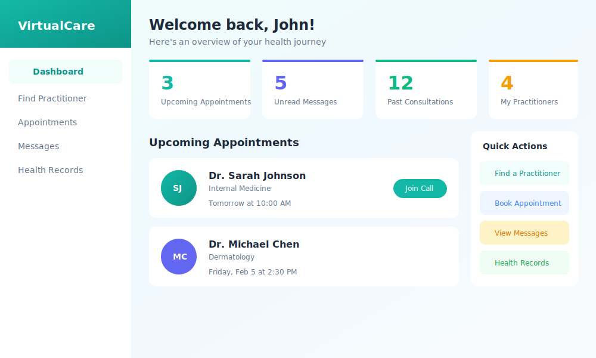
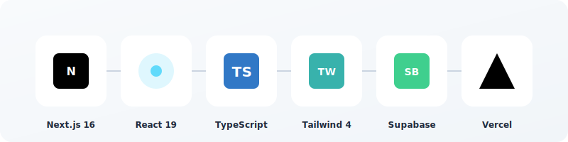
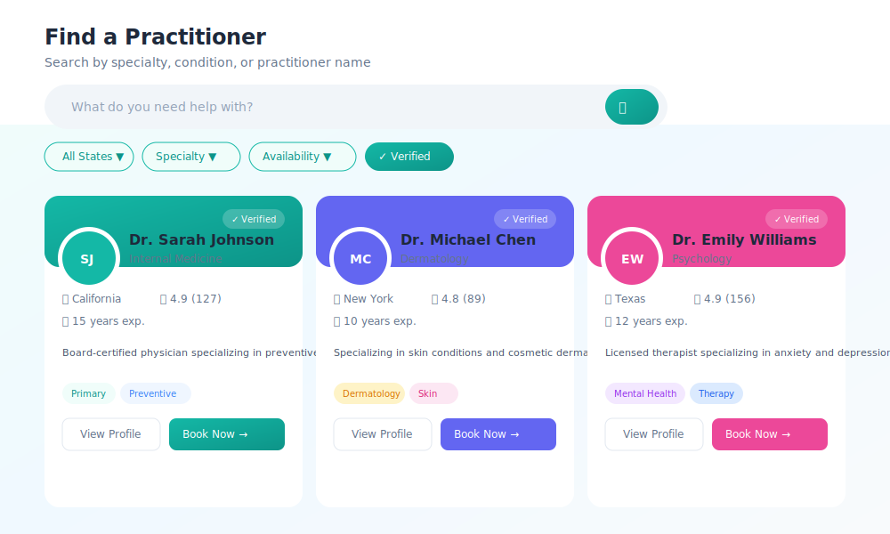
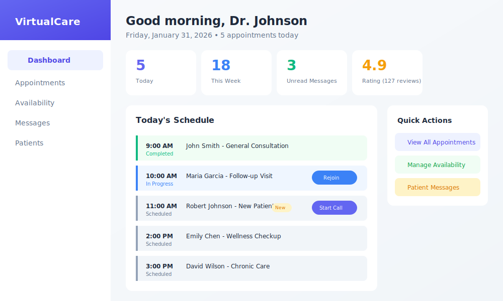
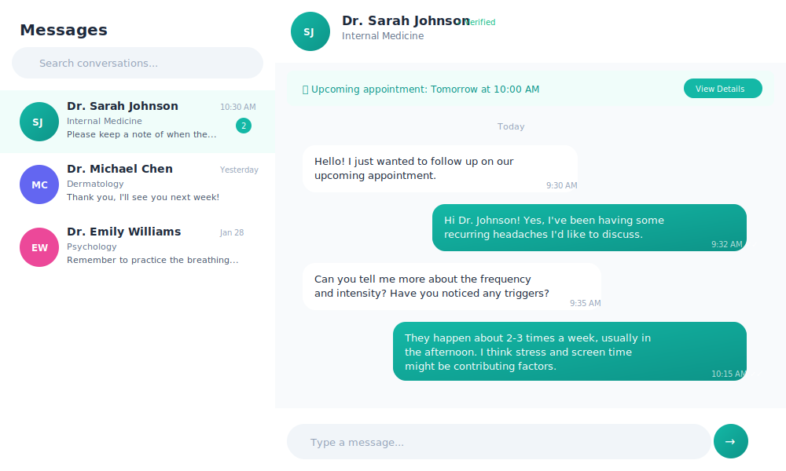
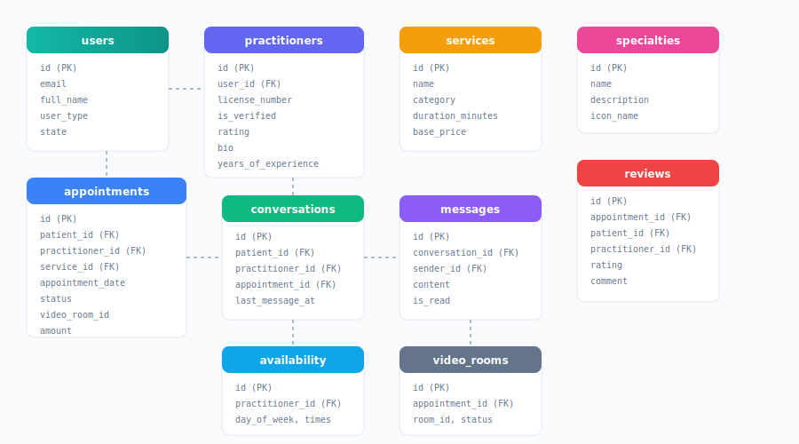

<p align="center">
  
</p>

<h1 align="center">VirtualCare</h1>

<p align="center">
  <strong>Modern Telehealth Platform for Virtual Healthcare Consultations</strong>
</p>

<p align="center">
  <a href="#features">Features</a> •
  <a href="#tech-stack">Tech Stack</a> •
  <a href="#getting-started">Getting Started</a> •
  <a href="#screenshots">Screenshots</a> •
  <a href="#architecture">Architecture</a>
</p>

<p align="center">
  
  
  
  
  
</p>

---

<p align="center">
  
</p>

## 🏥 About VirtualCare

**VirtualCare** is a comprehensive telehealth platform that connects patients with healthcare practitioners through secure video consultations. Built with a patient-first philosophy, the platform makes healthcare accessible, convenient, and personal.

### Core Philosophy

> **"Patients think in problems. Practitioners think in schedules."**

This guiding principle shapes every aspect of our UX design:

| Patient Experience | Practitioner Experience |
|-------------------|------------------------|
| 🌿 Guided & Reassuring | ⚡ Operational & Efficient |
| 🎯 Problem-Focused | 📅 Schedule-Driven |
| 💚 Soft Teal/Green Tones | 💜 Indigo/Purple Accents |
| 🤝 Choice-Oriented | 📊 Data-Dense Views |

---

## ✨ Features

### For Patients

<table>
<tr>
<td width="50%">

**🔍 Smart Practitioner Search**
- Search by symptom, specialty, or name
- Filter by state, availability, rating
- View verified credentials

**📅 Easy Booking**
- Step-by-step booking flow
- Select service → Pick date → Choose time
- Instant confirmation

**💬 Secure Messaging**
- WhatsApp-style chat interface
- Message history with practitioners
- Appointment context in conversations

</td>
<td width="50%">

**📹 Video Consultations**
- HD video calls with practitioners
- Screen sharing for test results
- Recording available (with consent)

**📋 Health Records**
- View consultation notes
- Track medications & allergies
- Access visit history

**⭐ Reviews & Ratings**
- Leave feedback after visits
- Help others find great care
- View practitioner ratings

</td>
</tr>
</table>

### For Practitioners

<table>
<tr>
<td width="50%">

**📊 Command Center Dashboard**
- Today's schedule at a glance
- Patient queue management
- Quick stats & metrics

**📆 Appointment Management**
- Week view calendar
- Status tracking (scheduled, in-progress, completed)
- New patient indicators

**💬 Patient Communications**
- Centralized messaging
- Quick response templates
- Appointment context

</td>
<td width="50%">

**⏰ Availability Management**
- Set weekly schedule
- Block specific time slots
- Manage service offerings

**📝 Clinical Notes**
- SOAP note templates
- Prescription management
- Follow-up scheduling

**✅ Verification System**
- License verification badge
- Build patient trust
- Professional credentials

</td>
</tr>
</table>

---

## 🛠 Tech Stack

<p align="center">
  
</p>

| Layer | Technology |
|-------|------------|
| **Frontend** | Next.js 16, React 19, TypeScript |
| **Styling** | Tailwind CSS v4, Framer Motion |
| **UI Components** | Radix UI, Lucide Icons |
| **Backend** | Next.js API Routes |
| **Database** | Supabase (PostgreSQL) |
| **Authentication** | Supabase Auth |
| **Video** | Daily.co / WebRTC |
| **Deployment** | Vercel |

---

## 🚀 Getting Started

### Prerequisites

- Node.js 18+ 
- npm or yarn
- Supabase account

### Installation

```bash
# Clone the repository
git clone https://github.com/yourusername/virtualcare-platform.git
cd virtualcare-platform

# Install dependencies
npm install

# Set up environment variables
cp .env.example .env.local

# Run the development server
npm run dev
```

### Environment Variables

Create a `.env.local` file with your Supabase credentials:

```env
NEXT_PUBLIC_SUPABASE_URL=your_supabase_url
NEXT_PUBLIC_SUPABASE_ANON_KEY=your_anon_key
SUPABASE_SERVICE_ROLE_KEY=your_service_role_key
```

### Database Setup

Run the schema in your Supabase SQL Editor:

```bash
# The schema file is located at:
supabase/schema.sql
```

---

## 📸 Screenshots

### Patient Dashboard

<p align="center">
  
</p>

*A welcoming, guided experience with upcoming appointments, quick actions, and health tips.*

### Find a Practitioner

<p align="center">
  
</p>

*Smart search with filters for specialty, location, availability, and ratings.*

### Practitioner Command Center

<p align="center">
  
</p>

*Operational dashboard with today's schedule, patient queue, and key metrics.*

### Messaging

<p align="center">
  
</p>

*WhatsApp-style messaging with appointment context and read receipts.*

---

## 🏗 Architecture

```
virtualcare-platform/
├── public/
│   └── images/           # Static assets
├── src/
│   ├── app/              # Next.js App Router
│   │   ├── api/          # API Routes
│   │   ├── booking/      # Booking flow
│   │   ├── consultation/ # Video consultation
│   │   ├── dashboard/    # Patient & Practitioner dashboards
│   │   ├── login/        # Authentication
│   │   ├── practitioner/ # Practitioner profiles
│   │   └── register/     # Registration flow
│   ├── components/
│   │   └── ui/           # Reusable UI components
│   └── lib/
│       ├── api/          # API types
│       └── supabase/     # Supabase clients
└── supabase/
    └── schema.sql        # Database schema
```

### Database Schema

<p align="center">
  
</p>

Key tables:
- `users` - Patient and practitioner accounts
- `practitioners` - Practitioner profiles with credentials
- `appointments` - Booking records
- `conversations` & `messages` - Messaging system
- `reviews` - Patient feedback
- `services` & `specialties` - Consultation types

---

## 🎨 Design System

### Color Palette

| Purpose | Patient UI | Practitioner UI |
|---------|-----------|-----------------|
| Primary | `teal-500` | `indigo-500` |
| Success | `emerald-500` | `emerald-500` |
| Warning | `amber-500` | `amber-500` |
| Background | `slate-50` | `slate-50` |

### Typography

- **Headings**: Inter (Bold, Semibold)
- **Body**: Inter (Regular, Medium)
- **Monospace**: JetBrains Mono

### Components

- Rounded corners (`rounded-xl`, `rounded-2xl`)
- Soft shadows (`shadow-lg`, `shadow-xl`)
- Gradient accents
- Glassmorphism for auth pages

---

## 📄 License

This project is licensed under the MIT License - see the [LICENSE](LICENSE) file for details.

---

## 🤝 Contributing

Contributions are welcome! Please read our [Contributing Guide](CONTRIBUTING.md) for details.

1. Fork the repository
2. Create your feature branch (`git checkout -b feature/amazing-feature`)
3. Commit your changes (`git commit -m 'Add amazing feature'`)
4. Push to the branch (`git push origin feature/amazing-feature`)
5. Open a Pull Request

---

## 📞 Support

- 📧 Email: support@virtualcare.com
- 💬 Discord: [Join our community](https://discord.gg/virtualcare)
- 📖 Docs: [Documentation](https://docs.virtualcare.com)

---

<p align="center">
  Made with ❤️ for better healthcare access
</p>

<p align="center">
  <a href="https://virtualcare.com">Website</a> •
  <a href="https://twitter.com/virtualcare">Twitter</a> •
  <a href="https://linkedin.com/company/virtualcare">LinkedIn</a>
</p>
